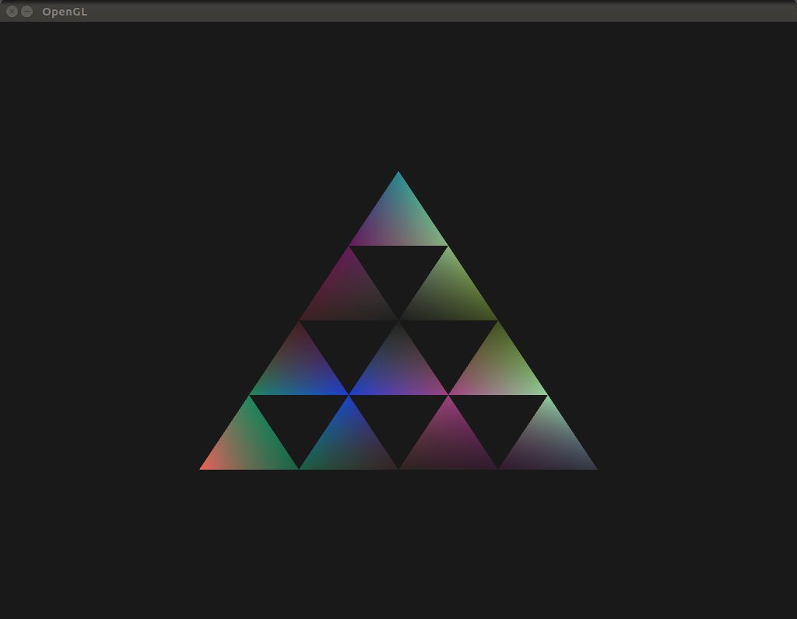

# Task 1
## b
Created a little pyramid-thing where the vertices have a random color.


The code that generates the vertices starts at the bottom row left, draws first the bottom row, then goes up to the next row and repeats. 
Note that the `VertexBuffer` class is contains both the coordinate and the color. 
```cpp
VertexBuffer vertices;
for (int row = 0; row < 5; row++) {
  int n_cols = 5 - row;
  for (int i = 0; i < n_cols; i++){
    std::array<float, 3> coord;
      coord[0] = -0.5 + 0.125*static_cast<float>(row) + 0.25*static_cast<float>(i);
      coord[1] = -0.5 + 0.25*static_cast<float>(row);
      coord[2] = 0.0;
      
      vertices.AddVertex(coord, CreateRandomColor();
  }
}
```

The index buffer is hard-coded as follows
```cpp
std::array<unsigned int, 30> indexBuffer = {
	0,1,5,
	1,2,6,
	2,3,7,
	3,4,8,
	5,6,9,
	6,7,10,
	7,8,11,
	9,10,12,
	10,11,13,
	12,13,14,
};
```

# Task 2
## a
The picture is drawn (figure \ref{task2i}) with a red green and blue triangle. The alpha channel is `a=0.3` on all triangles. 
The red is drawn at `z=0.5`, green at `z=0`, and blue at `z=-0.5`. 
The order draw order is front to back, meaning blue then green then red. 

\includegraphics[width=0.8\textwidth]{Task2_i.png}


## b
### i
Draw order is red green blue, 

- Effect on blended color:

	The blended color seems to be most strongly affected by the last
	drawn color. 
- Why:

	My explanation for this is that when the last color gets mixed in, it gets mixed with a mix of the two underlying colors. 
	Therefore the further back in the draw chain something is, the more
	layers will be mixed in on top, and thus the less impact it will have
	on the resulting mix. 

\includegraphics[width=0.5\textwidth]{Task2_i_first.png}
\includegraphics[width=0.5\textwidth]{Task2_i_exchanged.png}

### ii

\includegraphics[width=0.5\textwidth]{Task2_b_ii_1.png}
\includegraphics[width=0.5\textwidth]{Task2_b_ii_2.png}
\includegraphics[width=0.5\textwidth]{Task2_b_ii_3.png}

The top left is the reference image. Top right is the same except red and
blue triangles have swapped the z value. This means it's drawn front to back. 
In the bottom image, the draw order is also changed so that it's drawn back
to front. 

In the top right, where the draw order is front-to-back, it looks like the
green triangle is on top of the red one, which it isn't according to the 
z-coordinate. This is because green was drawn after red. 

From what I can tell, the blended area is the same when only the z-buffer
buffer is changed. It's only after changing the draw order that the area
changes color. 


# Task 3

