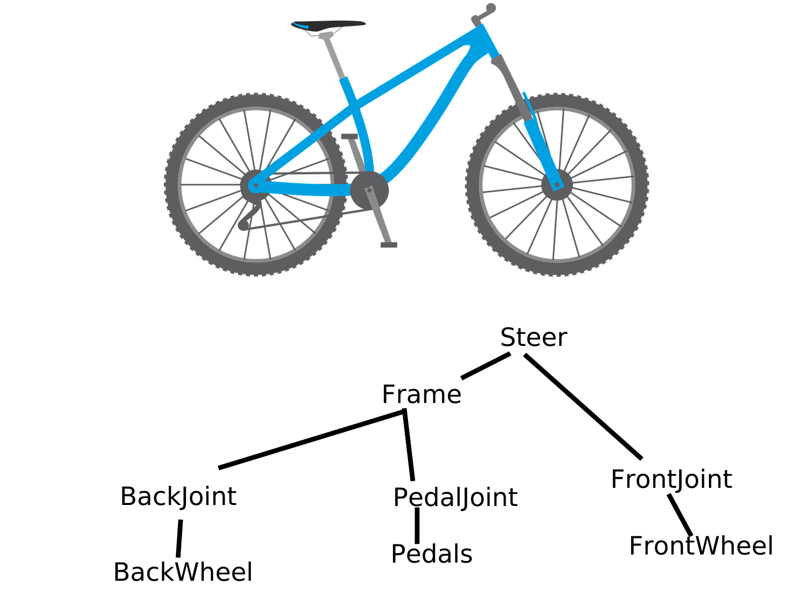
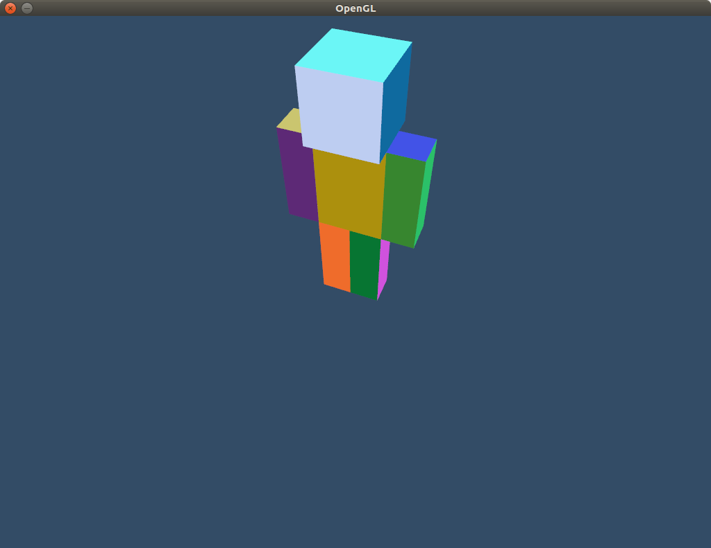

# Task 1: Reference points
## a
### i

### ii
We first need to translate to the backwheel to the frame reference point, then do rotation, and then move it back to its place. 

\begin{equation}
    \text{BackWheelRotate}(30^\circ) = \text{Translate}(-7,4) \text{Rotate}(30^\circ) \text{Translate}(7,-4)
\end{equation}

Transforming the wheel from right to left with the above equation should result in a rotation about the back wheel reference point.

# Task 2: Getting started

## a
In order to make the character visible, I added a camera and a perspective projection. By moving the camera around I 
captured this image. I also modified the buffer from task 1 to add support for the mesh colors.

## b
### i
The w-component of the homogeneous coordinates gives an elegant way to perform translations. 
Vertices are represented in homogeneous coordinates as $(x,y,z,1)$. Since the w-component is 1
we can use it to translate in x,y, and z by using the transformation matrix

\begin{equation}
    \text{Translate}(dx,dy,dz)
    =
    \begin{bmatrix}
        1 & 0 & 0 & dx \\
        0 & 1 & 0 & dy \\
        0 & 0 & 1 & dz \\
        0 & 0 & 0 & 1 
    \end{bmatrix}.
\end{equation}

### ii
Perspective transformation is not an affine transformation, but wince we always map a point 
$(x,y,z,w)$ to $(x/w, y/w, z/w, 1)$, we can perform perspective transformations quite easily. 

To do emulate perspective, we we want to shrink coordrinates toward the center of the screen 
based on the z-coordinate. The formala for x is roughly this $$x' = -x/z$$.
This is not affine but due to the above mentioned convention, we can do it if we get the z-coordinate
to the w-coordinate using an affine transformation. That is if we can make the coordinate look
like $(x,y,z,-z)$, then we will have performed perspective division. 

A simple affine transform that does this is

\begin{equation}
    \begin{bmatrix}
        1 & 0 & 0 & 0 \\
        0 & 1 & 0 & 0 \\
        0 & 0 & 1 & 0 \\
        0 & 0 & -1 & 0 
    \end{bmatrix}.
\end{equation}

### iii
The viewport transform is the transformation that takes vertices from the normalized device 
coordinate space to the window space. Usually this means mapping object from in the cube
$-1 \leq x,y,z \leq 1$, into a space parametrized by screen size and near/far z-clipping values. 

# Task 4
## f
I could figure out how to make the character rotate correctly when moving on path, so it looks
a bit wonky. 

