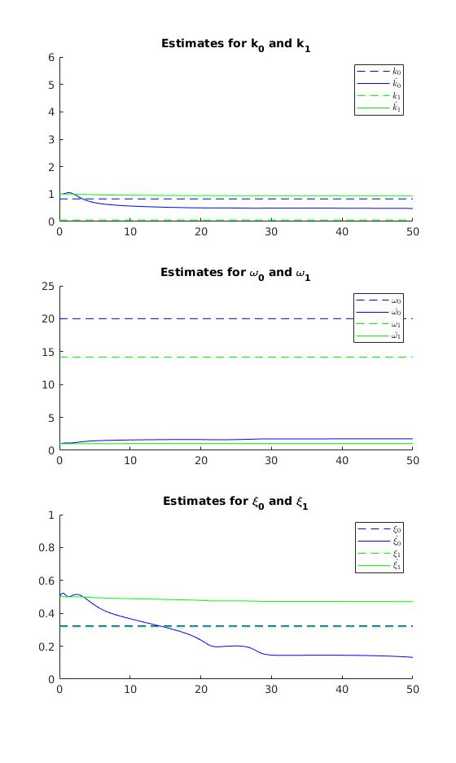
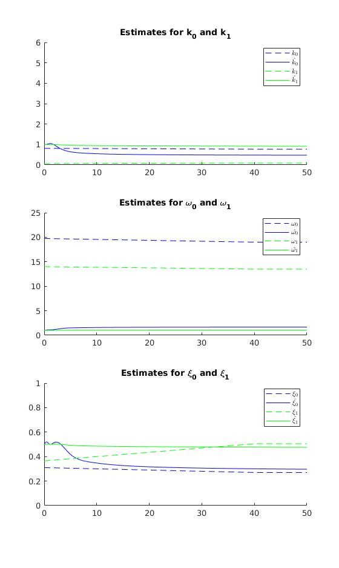

# Problem 4.10

## c
We will modify the gradient algorithm to include projection. 
Before adding projection, we have the adaptive law
\begin{align}
  \dot{\theta} = \Gamma \epsilon \phi 
\end{align}

To apply projection we need a function $g(\theta)$ such that $g(\theta) \leq 0$ when 
$0 \leq \beta \leq 1$, $k \geq 0.1$, and $m \geq 10$. 

I wasn't able to find a single function that defines the area we want. 

To constrain $m$ we can use $g_1(m) = 10 - m$, giving $\nabla g_1(m) = -1$. 
For $\beta$, we can use that $g_2(\beta) = \beta (\beta - 1) \leq 0$ in the are we are interested in. 
We then have $\nabla g_2(\beta) = 2 \beta - 1$. 
To constrain $k$ we can use $g_3(k) = 0.1 - k$, giving $\nabla g_3(k) = -1$. 

Will try to use $g(\theta) = g_1 + g_2 + g_3 = 10 - m + \beta (\beta - 1) + 0.1 - k$, which is negative on the
when $\theta \in S$, but is not positive everywhere outside so it doesn't satisfy the definition in (4.4.3). 

We then have
$$
  \nabla g = \begin{bmatrix} -1 & 2\beta - 1 & -1 \end{bmatrix}
$$

We can then update the adaptive law to use this information.

\begin{align}
  \dot{\theta} = \text{Pr}(\Gamma \epsilon \phi)
\end{align}

## d

# Problem 4.11

## a

To create an on-line estimation scheme, I will develop a linear parametric form.

We have $(r - \theta_p) G_0(s) = \theta_p$. This gives
\begin{align}
  (r - \theta_p) k_0\omega_0^2 &= (s^2 + 2\xi_0\omega_0 s + \omega_0^2(1 - k_0)) \theta_p \\
  r k_0 \omega_0^2 &= (s^2 + 2\xi_0\omega_0 s + \omega_0^2) \theta_p \label{eq:step_in_calculation} \\
  \frac{r}{\Lambda_1} &= \left(\frac{1}{k_0\omega_0^2}s^2 + \frac{2\xi_0\omega_0}{k_0\omega_0^2}s + \frac{1}{k_0}\right) \frac{\theta_p}{\Lambda_1} \\
  \frac{r}{\Lambda_1} &= \left(\theta_1s^2 + \theta_2 s + \theta_3\right) \frac{\theta_p}{\Lambda_1}
\end{align}
where $\Lambda_1(s)$ is Hurwitz and at least of order 2. 

Using $z_1 = \frac{r(s)}{\Lambda_1(s)}$, $\bar{\theta}_1 = \begin{bmatrix} \theta_1 & \theta_2 & \theta_3 \end{bmatrix}^T$, 
$\phi_1 = \begin{bmatrix} s^2 & s & 1 \end{bmatrix}^T \frac{\theta_p}{\Lambda_1} = \frac{\alpha_2(s)^T \theta_p}{\Lambda_1}$, we have written the system in linear parametric
form. To convert $\bar{\theta}_1$ to $k_0$, $\omega_0$, and $\xi_0$, we would use
\begin{align}
  k_0 &= \theta_3^{-1} \\
  \omega_0 &= \sqrt{\frac{\theta_3}{\theta_1}} \\
  \xi_0 &= \frac{1}{2}\frac{\theta_2}{\sqrt{\theta_1 \theta_3}}
\end{align}

To estimate the other set of parameters, we use $\theta_p G_1(s) = \dot{\theta}$. This gives
\begin{equation}
  \theta_p k_1 \omega_1^2 = (s^2 + 2 \xi_1 \omega_1 s + \omega_1^2) \dot{\theta} 
\end{equation}

Which is essentially the same as \cref{eq:step_in_calculation}, so we can write in linear parametric form using
$z_2 = \frac{\theta_p}{\Lambda_2}$, $\bar{\theta}_2 = \begin{bmatrix}\theta_4 & \theta_5 & \theta_6 \end{bmatrix}^T$, 
$\phi_2 = \frac{\alpha_2(s)^T \dot{\theta}}{\Lambda_2}$. 

To convert to the system parameters, we use 
\begin{align}
  k_1 &= \theta_6^{-1} \\
  \omega_1 &= \sqrt{\frac{\theta_6}{\theta_4}} \\
  \xi_1 &= \frac{1}{2}\frac{\theta_5}{\sqrt{\theta_4 \theta_6}}
\end{align}

To write the entire system in linear parametric form, we look at $z = z_1 + z_2$. 

\begin{gather}
  z = \frac{r}{\Lambda_1} + \frac{\theta_p}{\Lambda_2} \\
    = \bar{\theta}_1^T\phi_1 + \bar{\theta}_2^T\phi_2 
    = \begin{bmatrix} \bar{\theta}_1 \\ \bar{\theta}_2 \end{bmatrix}^T 
          \begin{bmatrix} \phi_1 \\ \phi_2 \end{bmatrix}
    = \begin{bmatrix} \theta_1 \\ \theta_2 \\ \theta_3 \\ \theta_4 \\ \theta_5 \\ \theta_6 \end{bmatrix}^T 
          \begin{bmatrix} \frac{s^2}{\Lambda_1}\theta_p \\ \frac{s}{\Lambda_1}\theta_p \\ \frac{1}{\Lambda_1}\theta_p \\ \frac{s^2}{\Lambda_2}\dot{\theta} \\ \frac{s}{\Lambda_2}\dot{\theta} \\ \frac{1}{\Lambda_2}\dot{\theta}\end{bmatrix} 
    = \theta^T\phi
\end{gather}

To estimate $\theta$, we will use least-squares with forgetting factor, given below.
\begin{gather}
  \hat{z} = \theta^T\phi \\
  \epsilon = (z - \hat{z}) / m^2 \\
  \dot{\theta} = P\epsilon\phi \\
  \dot{P} = \begin{cases}
    \beta P - P \frac{\phi \phi^T}{m^2}P \quad\text{if $||P|| \leq R_0$} \\
    0 \quad\text{otherwise}
    \end{cases} \\
  P(0) = P_0 ,\quad ||P_0|| \leq R_0
\end{gather}

After experimenting a couple of hours with this, I was unable to get good convergence using this estimator.

### i

With $r = 10 \sin(0.2t) + 8$ and $V = 20 \text{mph}$, the best I got was this

Unfortunately, the estimates don't seem to converge to the true value on any of the parameters.

### ii
With $r = 5$ and $V$ increasing from 30 to 60 in 40 seconds, I got this

The estimates seem to converge on $k_i$ and $\xi_i$, but for $\omega_i$ the estimates are really off. 

